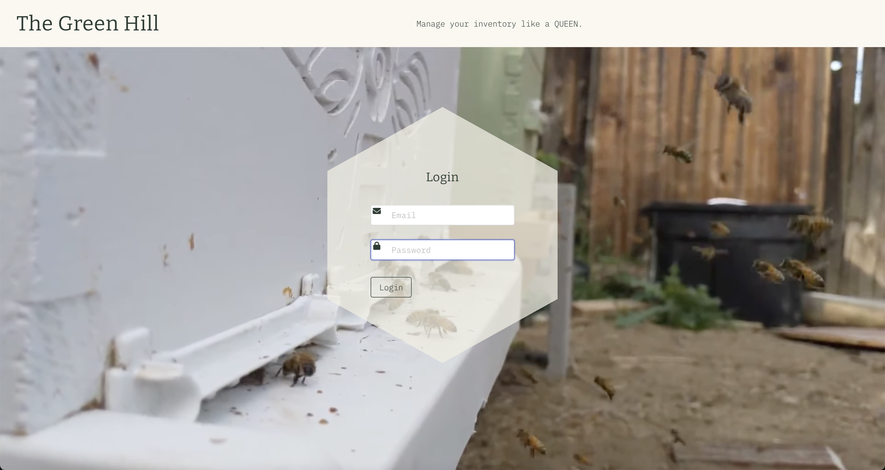
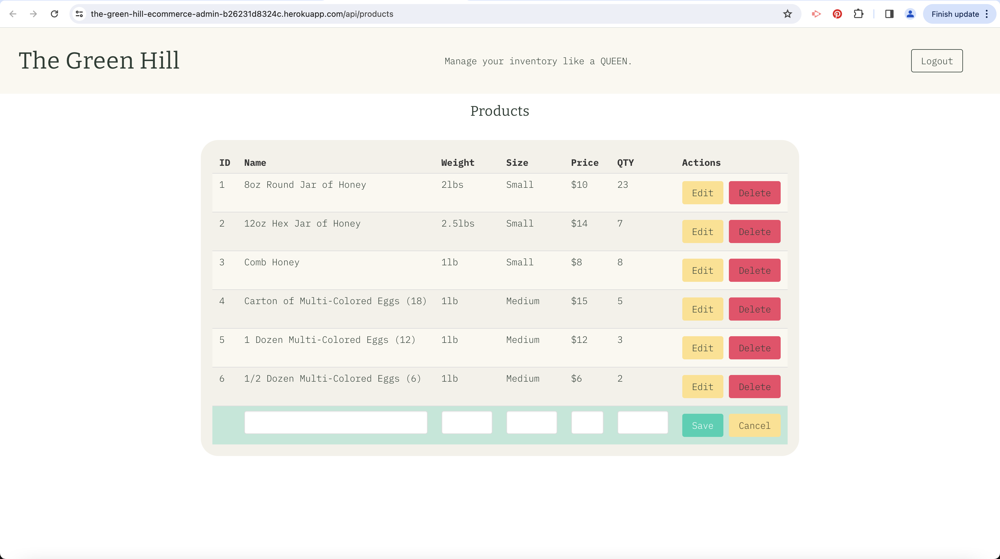

# The Green Hill

### Description

For this project, our task was to create a full-stack application. We created an application to help the Green Hill business to manage their inventory. This application allows then to add new products, update or delete existing products.

Below are the assigmemnt's requirements:

### User Story

- AS A business owner of Green Hill
- I WANT to be able to view and manage my inventory
- SO THAT I can organize and plan my customers' orders

### Acceptance Criteria

- WHEN I go to the website
- THEN I am presented with a login form
- WHEN I am logged in
- THEN I am presented with a formatted table showing the current inventory of the Green Hill business
- WHEN I click on the "+" button
- THEN an editable row appear at the bottom of the table to add the information of a new product
- WHEN I click on the Save button
- THEN the new production information is added to the table and in mySQL database
- WHEN I click on the Edit button
- THEN the selected row becomes editable and I can update the product
- WHEN I save the changes
- THEN the selected product is updated on the screen as well as in mySQL database
- WHEN click on the Delete button
- THEN the selected product is deleted from the application as well as in mySQL database
- WHEN click on the Logout button
- THEN my session is ended and I am redirected to the login page

## Installation

When used on a local computer through the GitHub repository, here are the steps to follow:
To start using the application, all dependencies need to be installed using the command npm i.
After installation, the Greenhill database needs to be generated by connecting to mySQL adn running the command source db/schema.sql. Once the database created, the data needs to be generated by using the following command in the terminal: node seeds/seeds.js. Then, run node server to have the application started and go to http://localhost:3001/

## Technologies 

* Node.js and Express.js to create a RESTful API.
* Handlebars.js as the templating engine.
* MySQL and the Sequelize ORM for the database.
* Bulma as CSS framework.

## Usage

This website is be used to manage the inventory of the Green Hill business.

# Screenshot

# Deployed

https://the-green-hill-ecommerce-admin-b26231d8324c.herokuapp.com/

## Credits

We used some code from these sources as a base for some of our work.

- For editable row: https://codepen.io/lookininward/pen/zYOQjZM

## License

Please refer to the LICENSE in the repo. ∆÷≥

## Contact

Elizabeth Ames, lizziejacoboo@gmail.com\
Ryan Darton, ryandarton@gmail.com\
Magali Lebon, magali.lb12@gmail.com\
Mason McNeil, masonamc5@gmail.com
